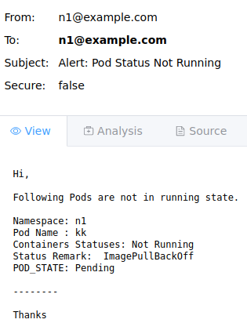

<h1 align="center">
  PodMonitor Kubernetes Controller
</h1>

<div align="center">

[](https://github.com/abhisheksuran/PodMonitor/actions/workflows/podmonitor_ci.yaml)
</div>

<p align="center">
This project provides a Rust-based custom resource and controller for Kubernetes. It introduces a custom resource, PodMonitor, which sends email notifications upon pod failures.
</p>

- [Steps to Deploy](#steps-to-deploy)
  - [1. Install the Controller](#1-install-the-controller)
  - [2. Initialize the Custom Resource Definition (CRD)](#2-initialize-the-custom-resource-definition-crd)
  - [3. Create a PodMonitor Instance](#3-create-a-podmonitor-instance)
    - [With Credentials](#with-credentials)
    - [Without Credentials](#without-credentials)
  - [4. Receive Notifications](#4-receive-notifications)
- [Email Sample](#email-sample)
- [License](#license)
- [References](#references)


## Steps to Deploy
### 1. Install the Controller

Apply the Kubernetes YAML configuration to set up the necessary components, including the namespace, service account, cluster role, role binding, and controller deployment:

Use PodMonitor.yaml from [release](https://github.com/abhisheksuran/PodMonitor/releases/tag/0.1.2) 
```
kubectl apply -f PodMonitor.yaml
```

Alternatively, you can run the Rust code directly:

```
nohup RUST_LOG=info  cargo run &
```
Or use the precompiled binary:

```
nohup RUST_LOG=info ./binary/podmon &
``` 
### 2. Initialize the Custom Resource Definition (CRD)
Once the controller is running, it will automatically create the CRD and operate in the background to manage instances of the custom resource.

### 3. Create a PodMonitor Instance

Define a new instance of the PodMonitor custom resource using the following YAML template:

#### With Credentials

```
apiVersion: "kk.dev/v1"
kind: PodMonitor
metadata:
  name: mymonitor
spec:
  name: mymonitor
  target_namespace: mynamespace
  target_pods:
  - pod1
  - pod2
  smtp_server: 127.0.0.1
  smtp_port: 25
  mail_to: user1@example.com
  mail_from: user2@example.com
  username: user
  password: pass

```
**Note**: **target_pods** is optional and if not defined will monitor all the pods in target_namespacess
The **username** and **password** fields are optional and depend on your SMTP server's configuration.

#### Without credentials

```
apiVersion: "kk.dev/v1"
kind: PodMonitor
metadata:
  name: mymonitor
spec:
  name: mymonitor
  target_namespace: mynamespace
  target_pods:
  - pod1
  - pod2
  smtp_server: 127.0.0.1
  smtp_port: 25
  mail_to: user1@example.com
  mail_from: user2@example.com

```

### 4. Receive Notifications
Whenever a pod fails in the specified namespace, you will receive an email notification according to the configuration set in the PodMonitor instance.


### Email Sample
<div align="center">



</div>

## License
This project is licensed under the MIT License. See LICENSE for details.

### References:

1. https://www.pavel.cool/posts/rust-kubernetes-operators/
2. https://www.youtube.com/watch?v=feBYxeO-3cY
